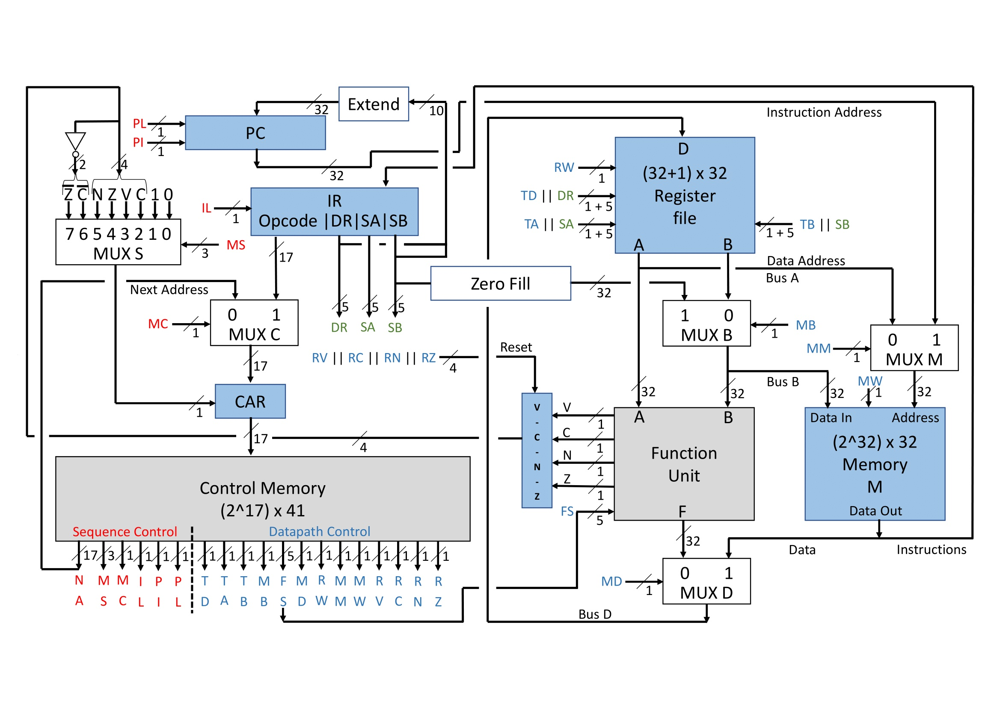
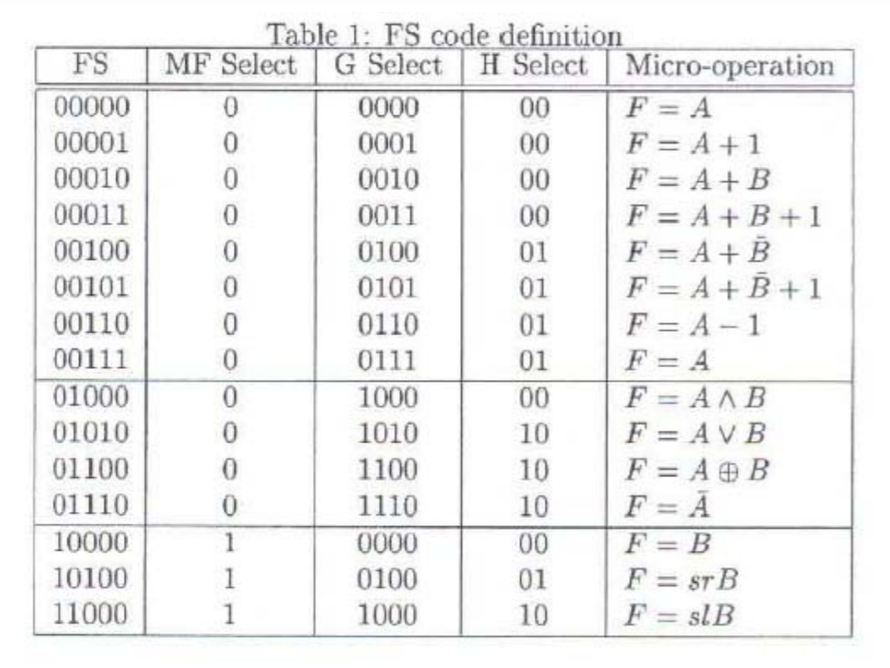

# Microcoded-Instruction-Set-Processor
# <h1 align="center">Microprogrammed Instruction Set Processor</h1>
<h2 align="center">By Prathamesh Sai</h2>

<h3 align="center">What does this consist of?</h3>

A register file with 33 registers, where each can store 32 bits. The register file is a component of the Datapath which also includes the Functional Unit (consisting of the Arithmetic Logic Unit & Shifter). There is also Memory M which is has a size of 2^32 x 32 bits, and Control Memory which has a size of 2^17 x 41 bits. There are also components such as the Program Counter (PC), the Control Address Register (CAR), multiple multiplexers, and logical systems to implement the Condition Code Flags (VCNZ) and Zero Fill.   
<h3 align="center">How it works.</h3>

Using VHDL, this project was made to implement the components of a microprogrammed instruction set processor. A crucial part of the processor is the datapath, which is carries out the majority of the calculations on behalf of the processor. Using FS codes, the processor can complete micro-operations listed below.
  

The particular combinatons of FS codes can invoke the Datapath to do particular micro-operations which can be used as part of a bigger instruction.

There are 15 types of micro-operations that the Datapath can complete, each being invoked by a particular FS code, and consequently a MF Select, G Select and H Select combination. 

These micro-operations constitute the building blocks of bigger instructions and consequently are important to building programs.

